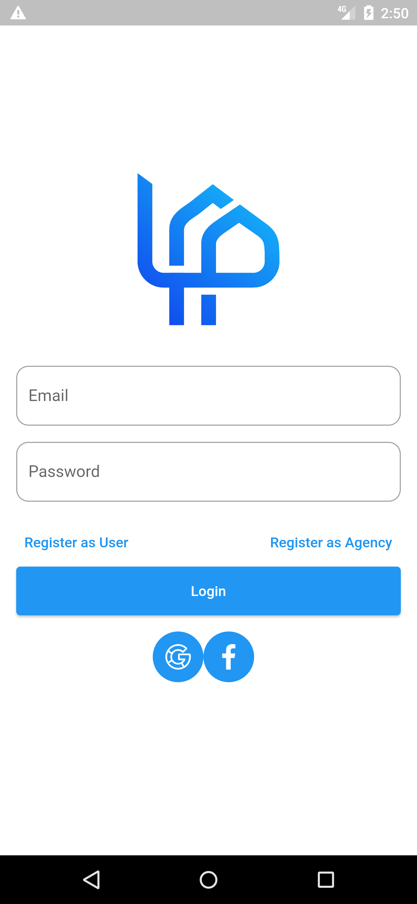
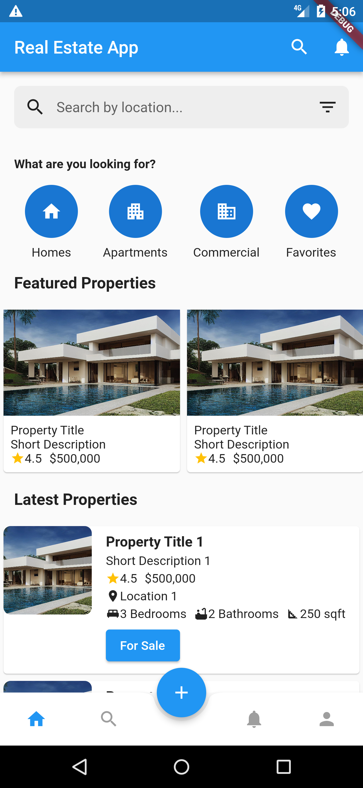

# Real Estate App

The Real Estate App is a Flutter-based mobile application that allows users to search and explore properties for sale and rent. It provides a user-friendly interface for browsing listings, filtering properties based on various criteria, and contacting the respective agencies or property owners for more information.

## Features

- Search for properties by location, price range, property type, and more.
- View detailed property listings with images, descriptions, and specifications.
- Save favorite properties for easy access.
- Contact agencies or property owners directly through the app.
- User registration and login functionality.
- Agency registration and login functionality.
- Add and manage properties for agencies.
- User-friendly interface and smooth navigation.

## Screenshots


*Caption for Screenshot 1*


*Caption for Screenshot 2*

## Getting Started

### Prerequisites

- Flutter SDK: Follow the [Flutter installation guide](https://flutter.dev/docs/get-started/install) to set up Flutter on your development machine.
- Git: [Install Git](https://git-scm.com/book/en/v2/Getting-Started-Installing-Git) for version control.

### Installation

1. Clone the repository:

   ```shell
   git clone https://github.com/your-username/real-estate-app.git
